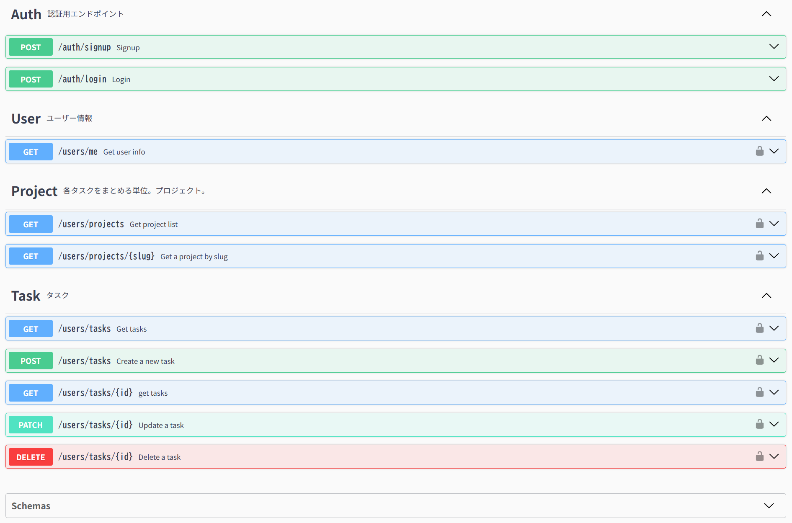

# express-web-api

Express + TypeScript + Prisma + PostgreSQL によるWeb APIプロジェクト。Docker ベースの開発環境で動作します。

## 技術スタック

| カテゴリ          | 採用技術                |
| ----------------- | ----------------------- |
| ランタイム        | Node.js 20 (Alpine)     |
| 言語              | TypeScript 6            |
| Webフレームワーク | Express 5               |
| ORM               | Prisma 7                |
| データベース      | PostgreSQL 16           |
| コンテナ          | Docker / Docker Compose |
| 認証              | bcryptjs / jsonwebtoken |

## 仕様

REST APIの仕様はOpenAPI 3.0で定義し、下記に記載。

**Swagger UI**: https://express-web-api.netlify.app

公開元ドキュメント: `docs/openapi.yaml`


## 前提条件

- [Docker Desktop](https://www.docker.com/products/docker-desktop/) がインストール済みであること
- Git がインストール済みであること

**ポート 5432 を占有するローカル PostgreSQL がある場合**、`.env` に `HOST_DB_PORT=5433` を追加してください（ホスト側のポートのみ変更されます）。

## セットアップ

### 1. リポジトリの取得

```bash
git clone <repository-url>
cd 0700-express-web-api
```

### 2. 環境変数ファイルの作成

`.env.example` をコピーして `.env` を作成します。

```bash
cp .env.example .env
```

### 3. 依存パッケージのインストール

```bash
npm install
```

### 4. Docker コンテナの起動

```bash
docker compose up -d
```

### 5. アプリの起動（ホスト側）

```bash
npx prisma generate
npm run dev
```

### 6. 動作確認

```bash
# DB コンテナの状態確認
docker compose ps

# Express への疎通確認
curl http://localhost:3000/

# DB 接続確認 (アプリ経由)
curl http://localhost:3000/health
```

## プロジェクト構成

```
.
├── prisma/
│   └── schema.prisma         # Prisma スキーマ定義
├── src/
│   └── index.ts              # Express エントリポイント
├── .env.example              # ローカル用環境変数テンプレート
├── docker-compose.yml        # DB サービス定義
├── package.json
├── prisma.config.ts          # Prisma CLI 設定
├── README.md
└── tsconfig.json
```

## 接続情報（開発環境）

| 項目        | 値                    |
| ----------- | --------------------- |
| アプリ URL  | http://localhost:3000 |
| DB ホスト   | 127.0.0.1             |
| DB ポート   | 5432                  |
| DB ユーザー | postgres              |
| DB 名       | express_web_api_db    |
